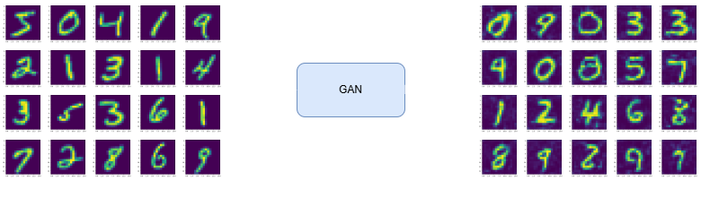

# Generative Adversarial Network (GAN) for image generation on MNIST dataset
Implementation of GAN model for image generation on MNIST dataset. Synthetic image generation of fruits using Generative Adversarial Network(GAN) model. 

## Input Dataset
MNIST dataset is the input dataset for the generative model. Dataset of size 60,000 samples have been used for training.

## Prerequisites
- Docker
If running without Docker, required python libraries:
- torch
- numpy
- matplotlib
- torchvision

## Running the Model
For training the model and image generation, 
```
# 1. Clone the repo
git clone https://github.com/Amal-Jyothis/mnist_gan
cd mnist-gan

# 2. Run with docker
docker build -t mnist-gan .
docker run -p 3000:3000 -v folder-path-for-outputs:/app/output mnist-gan
```
```folder-path-for-ouputs``` is the path of the folder where generated images needs to be stored.

## Results
Generated images are stored in ```folder-path-for-ouputs```. Realistic generation of numbers' images,<br/>




